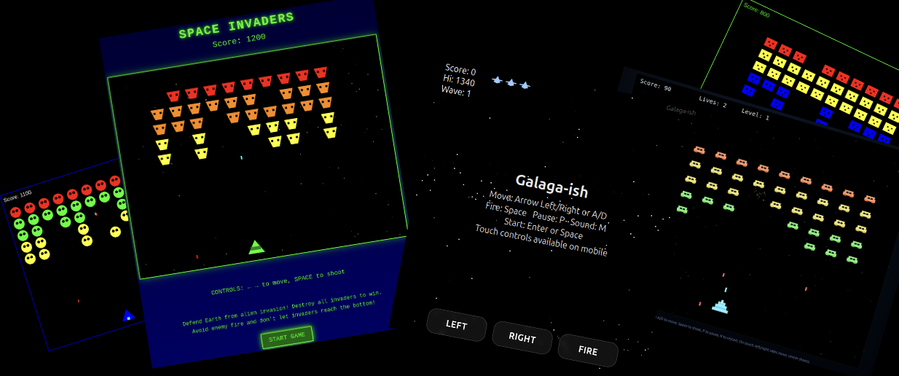

# Suitability of local LLMs for AI assisted coding with cline

## TL;DR;

1. local Qwen 3 coder 30B models are not as strong as larger models, but already quite usable. However, don't go below 4 bit quantisation. This means the models need 32 GiB VRAM to run fast and also have enough space for context.
2. mixes or prunes of Qwen 3 coder 30B models produced more bugs in my experiments.
3. all other local models tested (Qwen 3 30B, devstral, Skyfall, Nemotron nano 9B and Olmo 3 30B) either did not play well with `cline` or produced totally bugged code for my experiments.

## Introduction

I made this repo to document a couple of experiments I ran in Nov 2025
to assess the suitability of local LLMs for AI assisted programming.

Note that I specifically wanted to test this not via web interface to local LLMs, but when using a development environment. I chose VS Code and cline.

## Models tested

Online models I tested (via web interfaces) to establish a base line:

- Gemini 2.5 (Flash & Pro versions)
- GPT5
- Grok
- Opus 4.1 & Sonnet 4.5
- Qwen 3 max & Qwen 3 coder.

Local models I tested: 

- Qwen 3 coder 30B (from different sources and in different variants)
- mixes and pruned versions of Qwen 3 coder
- Qwen 3 30B (different sources)
- devstral 24B
- Skyfall 31B v4
- Nemotron Nano 9B v2
- Olmo 3 32B

Not every experiment tests every model, more information in the READMEs for the respective experiments.

## Hard- and software used

Software environment:

- Ubuntu 24.04, with NVidia drivers
- VSCode with the Cline extension for AI assisted coding, calling local Ollama models
- Ollama to run the LLM models

Relevant hardware:

- 2x NVidia 4060 Ti with 16 GiB each to run local models via Ollama

Context size for local models was set to 96 KiB for many local models as this fits into the 32 GiB VRAM of my to cards. Some models, especially older ones, however needed to have their context reduced or else they'd overflow to RAM and needed CPU computation.

## Experiments

The following is a list of experiments. I ran each model at least twice, the trial number is denoted by the postfix _tX in experiment directory, some of them more often. Local models that did not play well with `cline` however may have been run only once.

The files in this repository only record the final state of each experiment. That is, if intermediate versions existed that needed bugfix, those are not present.

Not every trial in the experiments is bugfixed. If needed I usually did one or two rounds of fixes and then stopped.

Experiments:

1. [YOLO Space Invaders!](./tests/01_SpaceInvaders_yolo/README.md) The LLMs all got this simple command `Write a space invaders game, contained in a single HTML file.` Base line, local models mostly Qwen 3 coder variants.
2. [YOLO Galaga!](./tests/02_Galaga_yolo/README.md) The LLMs all got this simple command `Write a Galaga game, contained in a single HTML file.` Base line, local models mostly Qwen 3 coder variants.
3. [Space Invaders, but deterministic look and feel (sorta)](./tests/03_SpaceInvaders_ddoc01/README.md). The LLMs got a ~14 KiB (2300 words) design document on what they should implement. Tested many more local models

<!-- Everything below this line is generated automatically, do not change -->
