# Space Invaders, now with a moderately well defined design document

One comment to get this out of the way: this turned out to have become a test of "how well can a local coding model solve a task when using cline" instead of a pure "how well does a coding model solve a coding task."

It is entirely possible that some of the models which somehow failed in this test would shine if only I had used other tools than `cline`. But I needed to draw a line somewhere.

## TL;DR;

1. With cline and 32 GiB VRAM I would use only more or less untampered Qwen 3 coder models:
   - qwen3-coder-30B as provided by Ollama
   - qwen3-coder-30B on Huggingface by unsloth. There one can also choose to run with higher quantisations (e.g. 6 bit).
2. Qwen 3 coder descendants that have been pruned or mixed seem to be worse than the original model.
3. With 32 GiB VRAM, qwen 3 coder 30B in 4 bit quantisation allow for ~ 100-110 k token context. Using more makes the computation spill over to RAM / CPU and becomes immediately slow by a factor 7 to 20 (depending of your CPU and RAM speed). Spoiler: 8 bit quantisation and 250k context needs ~60-62 GiB VRAM
4. Whatever is not specified exactly in the requirements is at the mercy of 'interpretation' of the model
5. Even when something is specified in a design document, there is a non-zero chance of it not being implemented by the model. Or implemented differently.


## The "Space Invaders" design document

As the prompt `Make me a Space Invaders game` is definitely too vague and produces too wide a variety of games with and without features one would expect, this experiment centers on the question how well LLMs stick to a moderately well defined design document.

The initial draft of the document was created with GPT-5. This was the prompt I gave to GPT-5:

```markdown
Your task is to create a description of the game "Space Invaders" that can be given to a junior programmer to implement. Things to keep in mind:
- the game should be implemented as single HTML file
- the game should have a title screen
- the description should be good enough so that a programmer can recreate it without having seen the game
- the description should be accurate enough so that if it given to different programmers, the look and feel is identical
- the graphics should look modern and fresh, all movements should be smooth
- each invader row should have an own color
- there should be 4 bunkers, each having 5x4 blocks. Each block having 1 hitpoint (destroyed on hit)
- there should be sound effects
- the player should have 3 lives
- the game should display the lives, the level, current score and high-score. These displays should always be visible during game.
- the game should have a game over screen with the possibility to restart
```

The resulting document (after a bit of manual editing), is [this one](./designdoc.md). You will note it is, although still not specifying everything down to the last detail, already ~2300 words long (~14 KiB). I think it's a moderately usable design document which should get the job done. Not terrible, but not brilliant either.

### Some specifications intentionally left vague
Note that I left a few points intentionally as vague as they were given by ChatGPT.

#### No coding style or guidelines

This was by design to see whether a kind of overarching pattern would emerge. Spoiler alert: none that I could discern.

#### Look of the alien invaders
Invaders were specified with
- each invader row has its own color, with a color palette given for each row.
- Invader body fill: row color, with a thin stroke rgba(255,255,255,0.08) and slight drop shadow (draw a blurred rectangle/ellipse behind). Invader animation: two frames (open/closed) toggled on a timer to produce the classic movement feel.

The shape is completely left out

#### Starfield
These were the two lines with info on a starfield
- Background: deep navy #071029 with subtle starfield (animated parallax dots).
- draw background + starfield (update starfield positions slowly)

This did not specify color, size, shape, number, or distribution of stars.

## Models tested

I'll define a baseline using some of the strongest currently available models to have something to compare to.

### Online models in test

Taking into account some learnings from the results of the last test, I chose to leave out Gemini (Flash and Pro) and Claude Opus 4.1. On the other hand, I added Qwen 3 max into the mix.

Online models I tested (via web interfaces) to establish a base line:

- GPT5
- Grok
- Qwen 3 coder
- Qwen 3 max
- Sonnet 4.5

When the models had a reasoning effort available, I set it to "high".

I tested each model twice. Qwen 3 max 3 times, as in the first trial I forgot to ask to fix the bugs.

### Local models in test

#### Qwen 3 coder family

- Qwen 3 coder via [Ollama Qwen3-coder 30B](https://ollama.com/library/qwen3-coder) as delivered by Ollama by
  default. That is a 4 bit quantisation
  model and allows me to have a bit more than 96k tokens of context on my 32 GiB VRAM
- Qwen 3 coder via unsloth@huggingface [Qwen3-Coder-30B-A3B-Instruct](https://huggingface.co/unsloth/Qwen3-Coder-30B-A3B-Instruct-GGUF) in 2, 3, 4, and 6 bit quantisation.  
  I also threw in their "UD 4 bit XL" model. UD stands for "Unsloth Dynamic", a special
  kind of quantisation reduction they claim produces better results than other methods.
- A merge. [YOYO-AI/Qwen3-30B-A3B-CoderThinking-YOYO-linear](https://huggingface.co/YOYO-AI/Qwen3-30B-A3B-CoderThinking-YOYO-linear) One of the HuggingFace models I tried and behaved well enough with cline.
- A pruned Qwen 3 coder model. [hf.co/bartowski/cerebras_Qwen3-Coder-REAP-25B-A3B-GGUF](https://huggingface.co/bartowski/cerebras_Qwen3-Coder-REAP-25B-A3B-GGUF). The original model authors claim that their pruning to 25B preserved capabilities. I wanted to test that a bit, with 4 and 6 bit models.

#### Qwen 3 family

Beside the specialised coder version, I wanted to see how well (or not) the parent Qwen 3 model would fare.

- Qwen3 30B a3b via [Ollama qwen3:30b-a3b](https://ollama.com/library/qwen3:30b-a3b)
- Qwen3 30B Instruct via [Ollama qwen3:30b-instruct](https://ollama.com/library/qwen3:30b-instruct) in 4 bits
- Qwen3 30B Instruct via [hf.co/lmstudio-community/Qwen3-30B-A3B-Instruct-2507-GGUF](https://huggingface.co/lmstudio-community/Qwen3-30B-A3B-Instruct-2507-GGUF) 4 and 6 bits

#### Others

- devstral 24B via [Ollama ](https://ollama.com/library/devstral:24b) in 4 bit
- Skyfall 31B v4 via [hf.co/TheDrummer/Skyfall-31B-v4-GGUF:Q4_K_M](https://huggingface.co/TheDrummer/Skyfall-31B-v4-GGUF) for fun as it has the highest UGI score for models at max ~30B parameters in the [UGI Leaderboard](https://huggingface.co/spaces/DontPlanToEnd/UGI-Leaderboard). The authors describe it as "an upscaled version of Mistral Small 3.2 2507"
- Nemotron Nano 9B v2 via [hf.co/bartowski/nvidia_NVIDIA-Nemotron-Nano-9B-v2-GGUF](https://huggingface.co/bartowski/nvidia_NVIDIA-Nemotron-Nano-9B-v2-GGUF) as the highest scoring small model on [livecodebench](https://llm-stats.com/benchmarks/livecodebench), scoring even higher than the Qwen models.
- Olmo 3 32B via [olmo3-32B-think-unsloth](https://huggingface.co/unsloth/Olmo-3-32B-Think-GGUF). Fully open model which dropped in the week i did theses tests.
- GLM-Z1-32B-0414 via LMStudio community [GLM-Z1-32B-0414-GGUF](https://huggingface.co/lmstudio-community/GLM-Z1-32B-0414-GGUF)

## Results at a glance

The online models delivered between moderate and very good results.

The local models with around 30B parameters are between complete fail and moderately useful.

Interestingly enough, the local Qwen 3 coder models exhibited error patterns similar to their larger online brethren. And they often committed the same logic errors over and over again.

All models stuck quite well to the asks given in the design document ... when they implemented said feature as sometimes features were left out. Variability was observed where expected, e.g., graphics for aliens and player ship were not specified terribly well.

### Online models

- GPT5: 1 failed attempt, one successful on first pass. The successful trial had nice graphics and sound, few minor bugs. Very playable.
- Grok: 1 failed attempt, one successful on first pass. The successful trial had very simplistic, no bugs. Very playable.
- Qwen 3 coder: one almost perfect one-shot, one attempt without errors after one round of bug-fix.
- Qwen 3 max: 2 attempts successful, albeit both needing bug fixing rounds. Aliens are distinctively different / better looking than other models.
- Sonnet 4.5: 1 attempt directly without bugs, other with 2 bug fixing rounds. Very playable.

Qwen 3 coder delivered very solid performance. Qwen 3 max surprised me the most, I did not have it on the radar.

GPT5 and Grok disappointed a bit as both, in one attempt, delivered something that did not start and could not be fixed in two bug fixing rounds.

Sonnet with a very solid performance

With the very small sample size above, here's the list of models in descending order of "successful attempts to get a working game":

1. Qwen 3 coder and Sonnet 4.5
2. Qwen 3 max
3. GPT 5 and Grok

### Local models that (somehow) worked

- qwen3-coder-30B-cerebrasreap25B (6 bit): 1 very successful trial, one moderately, 4 fails. Definitely use 6 bit instead of 4, but still not really recommended.
- qwen3-coder-30B-ollama (4 bit): 2 successful trials (after debugging rounds), 4 fails.
- qwen3-coder-30B-unsloth (4bit): 1 moderately playable version, one good one (with debugging rounds)
- qwen3-coder-30B-unsloth (4bit UD): 1 moderately playable version, one good one (with debugging rounds). Tentatively better than the non-UD
- qwen3-coder-30B-unsloth (6bit UD): 5 trials. 1 extremely good. 1 good. 1 moderately playable. 2 fail.

### Local models I consider failed (for whatever reason)

One will note that Qwen 3 30B models are all in the "failed" category, though their untampered brethren from the Qwen 30B coder family all more or less work. 

- devstral: very slow code generation. Need to reduce context below acceptable level to let it run in 32 GiB VRAM. Extremely buggy result.
- NVidia Nemotron nano 9b: Total failure. Model rambling forever ("Wait, maybe the user meant ..."), destroying previously written code. Stopped experiment after 50 minutes.
- qwen3-30B-a3b-instruct-2507-lmstudio: same problems in 4 and 6 bit versions where very buggy code was produced. Also, seems to have compatibility problems with cline.
- qwen3-30B-a3b-ollama: slow as hell, complete fail, does not work.
- qwen3-30B-instruct-ollama: very buggy code, incompatibility to cline.
- qwen3-coder-30B-cerebrasreap25B (4 bit): 3 trials, all very buggy and bug fixing unsuccessful (when tried)
- qwen3-coder-30B-yoyolin: Model slow, doesn't play well with Cline. Chatty beyond belief, and broken result.
- skyfall-31B-v4-thedrummer: extremely slow model, derived from Mistral. Need to reduce context below acceptable level to have it run in VRAM. 2 trials, 2 complete fails.
- glm-z1-32B-0414-lmstudio: memory overrun to RAM despite VRAM free (Ollama problem?). But also cline interaction not working.

## Observations on code and specification adherence

### Often encountered bugs of Qwen 3 coder
Interestingly enough, the local Qwen 3 coder models exhibited error patterns similar to their larger online brethren. Two distinct errors occurred which often could only be fixed by hand when using local models:

1. the model liked to use dictionary entries in functions that were not defined in the dictionary they referred to. Specifically, INVADER_ROWS and INVADER_COLS of the CONFIG dictionary. The same error occurred in one of the documented online trial, where model was able to find the problem just by a description of what the user saw as effect. When this error occurred with the local model, in none of the trials the model was able to find the root cause of the bug when just being told about the effect on screen.
2. the model very often displayed a bug in the alien formation movement logic. That particular bug leads to the formation walk to a border and then, instead of dropping down a line, to slide immediately to the bottom of the screen and kill the player. Easy enough to fix by hand, but the models were not able to do it when just being told the effect the user saw on screen. The online model however could.

### Varying coding style and code quality

Whether functional, object oriented, or other, no specifications were given apart a short line asking to group numeric constant like so:
```text
- Keep all numeric constants up top as `const CONFIG = { CANVAS_W:800, CANVAS_H:600, ... }` so tuning is easy.
```

At the time of this first writing, I had 45 total trials. 11 for the online models, 34 for local models. Some numbers:
- Classes: 3/34 trials with local models went for object orientation by having at least one class object defined. From the 11 trials with online models, 5 used classes.
- gameState dictionary: 32/34 trials from local models used a dictionary called `gameState` to record different aspects of the running game. 5/11 trials with online models did the same.
- update(dt) function: 28/34 trials with local models had an update(dt) function, 10/11 for the online model trials.


#### Function size. E.g.: update(dt)

The design document gave 3 crucial hints on how to implement some of the core functionalities: the main game loop, an update function, and a render function.

The game loop was hinted at like this:
```text
# Pseudocode / main loop (concise)

let lastTime = performance.now();
function loop(now) {
  const dt = Math.min(0.033, (now - lastTime) / 1000); // clamp dt to avoid big jumps
  lastTime = now;
  update(dt);
  render();
  requestAnimationFrame(loop);
}
requestAnimationFrame(loop);
```

These were the specifications given for a function `update(dt)`:
```text
update(dt):
- handleInput(dt)
- update bullets positions, collisions
- update invader formation (move horizontally by speed*dt; if hits edge -> move down and flip)
- invader shooting logic (timer + random)
- update explosions and particles
- update HUD timers and check level completion
````

And this was information for the render function:
```text
render():

clear canvas
- draw background + starfield (update starfield positions slowly)
- draw invaders (alive ones)
- draw invader bullets
- draw bunkers (loop blocks)
- draw player and player bullets
- draw explosions
- draw HUD (top bar)
- draw overlays for paused/title/game over
```

I observed two different behaviours: sometimes the model put all code into one huge function with hundreds of lines of code, and at other times it made (the very sensible) decision to break down the functionality into subfunctions.

The following examples are all from the UD 6 bit model.

Here's [an example](./local/qwen3-coder-30B-unsloth/6bitUD_t5/space_invaders.html) where the model lumped everything into one function, 259 lines of code.


Here's a [particularly nice example](./local/qwen3-coder-30B-unsloth/6bitUD_t1/space_invaders.html) where during a code review, one would have very little to complain about (except the useless / redundant first if-clause):

```javascript
// Update game state
function update(dt) {
    if (gameState.state === 'TITLE') return;
    if (gameState.state === 'PLAYING' && !gameState.paused) {
        handleInput(dt);
        updateBullets(dt);
        updateInvaders(dt);
        updateExplosions(dt);
        updateParticles(dt);
        updateUFO(dt);
        checkLevelCompletion();
    }
}
```

The very same model, [in yet another run](./local/qwen3-coder-30B-unsloth/6bitUD_t3/space_invaders.html), mixed up the update and the render functions like this (note how `update()` re-implements large parts of `render()`):

```javascript
// Update game state
function update(dt) {
    if (gameState.state === 'TITLE') {
        drawTitleScreen();
        return;
    }
    if (gameState.state === 'GAMEOVER') {
        drawGameOverScreen();
        return;
    }
    if (gameState.paused) {
        drawPausedScreen();
        return;
    }
    // Update game elements
    updateStars(dt);
    handleInput(dt);
    updatePlayerBullets(dt);
    updateInvaderBullets(dt);
    updateInvaders(dt);
    updateUFO(dt);
    updateExplosions(dt);
    updatePlayerInvulnerability(dt);
    // Draw everything
    drawBackground();
    drawStars();
    drawInvaders();
    drawBunkers();
    drawBullets();
    drawExplosions();
    drawUFO();
    drawPlayer();
    drawHUD();
}
// Render game
function render() {
    // Clear canvas
    ctx.clearRect(0, 0, CONFIG.CANVAS_W, CONFIG.CANVAS_H);
    // Draw based on state
    if (gameState.state === 'TITLE') {
        drawTitleScreen();
    } else if (gameState.state === 'GAMEOVER') {
        drawGameOverScreen();
    } else if (gameState.paused) {
        drawPausedScreen();
    } else {
        // Draw game elements
        drawBackground();
        drawStars();
        drawInvaders();
        drawBunkers();
        drawBullets();
        drawExplosions();
        drawUFO();
        drawPlayer();
        drawHUD();
    }
}
```


### Specification adherence

Not many trial runs had all the the requirements from the specifications implemented. Features most often missing were (due to bugs or 'decision' by the LLM):
- shots by player or aliens (or both) going through bunkers and not destroying them
- no UFO, or if, then not destroyable by player
- starfield was completely missing in some trials. Often, if present, it was either static or randomly generated in every frame. Only a minority of trials showed parallax scrolling of stars.

## My current recommendation

At the moment I would use only more or less untampered Qwen 3 coder models:

- qwen3-coder-30B as provided by Ollama
- qwen3-coder-30B on Huggingface by unsloth. There one can also choose to run with higher quantisations (e.g. 6 bit, or even 8 if one has more than 32 GiB VRAM).

Qwen 3 coder descendants that have been pruned or mixed seem to be worse than the original model.

<!-- Everything below this line is generated automatically, do not change -->

---
---
---

> [!IMPORTANT]
> In the list of experiments below, click on the thumbnail to test - in your browser - the examples built by the LLMs.
> Clicking on the experiment name (left of thumbnail) brings you to the GitHub directory for
> the given experiment.

## Online model experiments for Space Invaders

### Experiment <a href="https://github.com/DrMicrobit/lllm_suit/blob/main/tests/03_SpaceInvaders_ddoc01/online/GPT5/t1">tests/03_SpaceInvaders_ddoc01/online/GPT5/t1</a>

<a href="https://drmicrobit.github.io/lllm_suit/tests/03_SpaceInvaders_ddoc01/online/GPT5/t1/space_invaders.html">
  
</a>

2:12 for first implementation. Broken. Asked this: "When opening the file in browser, I just see the playing field (score, highscore, lives, level, a star field, and short descriptions what key presses should do). But: nothing else. The game does not react to key presses, I cannot start the game."

Answer was broken fragments of code for "what to fix". Stopped experiment.

### Experiment <a href="https://github.com/DrMicrobit/lllm_suit/blob/main/tests/03_SpaceInvaders_ddoc01/online/GPT5/t2">tests/03_SpaceInvaders_ddoc01/online/GPT5/t2</a>

<a href="https://drmicrobit.github.io/lllm_suit/tests/03_SpaceInvaders_ddoc01/online/GPT5/t2/space_invaders.html">
  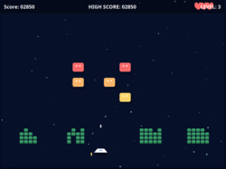
</a>

- Features: start screen, game over screen, 3 lives, score, high-score, sound. Mouse-control.
- Bugs: Minor, does not reset score to 0 for a new game. When aliens reach bottom, not immediate game over but successively killing remaining ships.
- Graphics: nice animated shapes. Starfield parallax, right to left (funny).
- Comments: Initial version took 2:27. Very playable.

### Experiment <a href="https://github.com/DrMicrobit/lllm_suit/blob/main/tests/03_SpaceInvaders_ddoc01/online/grok/t1">tests/03_SpaceInvaders_ddoc01/online/grok/t1</a>

<a href="https://drmicrobit.github.io/lllm_suit/tests/03_SpaceInvaders_ddoc01/online/grok/t1/space_invaders.html">
  
</a>

Initial version in under 2 minutes. However, non-functional. Indeed, Grok showed as one of the next options "Complete title and Game over screens". Maybe it was that?

2 minutes later, still not functional. --> When I open the file in a browser, I just see a dark blue background and a white rectangle frame, nothing else.

Another ~2 minutes later ... still non functional. Stopped this experiment.
### Experiment <a href="https://github.com/DrMicrobit/lllm_suit/blob/main/tests/03_SpaceInvaders_ddoc01/online/grok/t2">tests/03_SpaceInvaders_ddoc01/online/grok/t2</a>

<a href="https://drmicrobit.github.io/lllm_suit/tests/03_SpaceInvaders_ddoc01/online/grok/t2/space_invaders.html">
  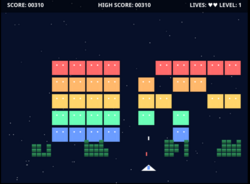
</a>

- Features: start screen, game over screen, score, high score, lives, UFO, and sound.
- Bugs: None, even UFO can be shot.
- Graphics: very, very simplistic shapes. Starfield, but no parallax.
- Comments: Initial version took 2:27. Very playable.

### Experiment <a href="https://github.com/DrMicrobit/lllm_suit/blob/main/tests/03_SpaceInvaders_ddoc01/online/qwen3-coder/t1">tests/03_SpaceInvaders_ddoc01/online/qwen3-coder/t1</a>

<a href="https://drmicrobit.github.io/lllm_suit/tests/03_SpaceInvaders_ddoc01/online/qwen3-coder/t1/space_invaders.html">
  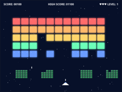
</a>

1:30 --> When starting the game, there are no aliens on screen?

Fix in ~30s, albeit as code frgament.

IMPORTANT: the cause of this error was analysed correctly by Qwen 3 coder, here is the analysis.
```text
You're right, I see the issue. The problem is that I defined CONFIG.INVADER_COLS and CONFIG.INVADER_ROWS constants but then hardcoded the values (5 rows, 11 columns) directly in the initInvaders() function. The constants weren't defined in the CONFIG object, causing the invaders to be positioned incorrectly.
```

To keep in mind: the above error cause will strike again in multiple trials with local Qwen 3 coder descendants. Though there, the models were not able to find the cause.

- Features: start screen, game over screen, 3 lives, score, high-score, sound.
- Bugs: None after above bugfix.
- Graphics: very simplistic shapes, ok-ish. Starfield parallax.
- Comments: Very playable, albeit speed increase of alien formation a bit too steep.
### Experiment <a href="https://github.com/DrMicrobit/lllm_suit/blob/main/tests/03_SpaceInvaders_ddoc01/online/qwen3-coder/t2">tests/03_SpaceInvaders_ddoc01/online/qwen3-coder/t2</a>

<a href="https://drmicrobit.github.io/lllm_suit/tests/03_SpaceInvaders_ddoc01/online/qwen3-coder/t2/space_invaders.html">
  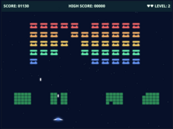
</a>

1:22 for a perfect one-shot without major bugs.

- Features: start screen, game over screen, 3 lives, score, high-score, level, sound.
- Bugs: minor after above bugfix. Aliens don't increase speed during level.
- Graphics: interesting alien shapes. Starfield parallax.
- Comments: Very playable.
### Experiment <a href="https://github.com/DrMicrobit/lllm_suit/blob/main/tests/03_SpaceInvaders_ddoc01/online/qwen3-max/t0">tests/03_SpaceInvaders_ddoc01/online/qwen3-max/t0</a>

<a href="https://drmicrobit.github.io/lllm_suit/tests/03_SpaceInvaders_ddoc01/online/qwen3-max/t0/space_invaders.html">
  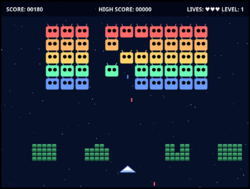
</a>

- Features: start screen, game over screen, 3 lives, score, high-score, sound.
- Bugs: small and game-breaking. E.g.: UFO cannot be shot, high-score stored only once. Weird: sometimes, hitting space bar to fire resets the whole game
- Graphics: nice shapes. Smooth animations. Starfield parallax right to left, funny.
- Comments: Initial version took 3:27. Would be very playable if not for game breaking space bar bug.


Didn't give Qwen3 Max the benefit of the doubt ... forgot to ask for corrections. Will redo.
### Experiment <a href="https://github.com/DrMicrobit/lllm_suit/blob/main/tests/03_SpaceInvaders_ddoc01/online/qwen3-max/t1">tests/03_SpaceInvaders_ddoc01/online/qwen3-max/t1</a>

<a href="https://drmicrobit.github.io/lllm_suit/tests/03_SpaceInvaders_ddoc01/online/qwen3-max/t1/space_invaders.html">
  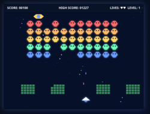
</a>

- Features: start screen, no game over screen, score, high score, lives, UFO, and adjustable sound.
- Bugs: No possibility to restart game. Stars not distributed randomly.
- Graphics: simple aesthetics, animated aliens. Player ship with temporary shield shown, nice.
- Comments: Initial version very playable, did not ask for bugfix.

### Experiment <a href="https://github.com/DrMicrobit/lllm_suit/blob/main/tests/03_SpaceInvaders_ddoc01/online/qwen3-max/t2">tests/03_SpaceInvaders_ddoc01/online/qwen3-max/t2</a>

<a href="https://drmicrobit.github.io/lllm_suit/tests/03_SpaceInvaders_ddoc01/online/qwen3-max/t2/space_invaders.html">
  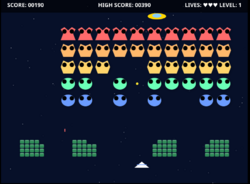
</a>

Initial version after 2:39 --> The code has two bugs: 1. the player ship cannot be moved, it is stuck to the right edge of the screen and 2. the alien formation does not reverse direction when hitting a border. Please fix.

Another ~3 minutes later, works.

- Features: start screen, game over screen, score, high score, lives, UFO, and sound.
- Bugs: None, even UFO can be shot.
- Graphics: very blocky aesthetics. But shapes are nice, 1st time I see different alien shapes. Starfield, but no parallax.
- Comments: Very playable, no remaining bugs.

### Experiment <a href="https://github.com/DrMicrobit/lllm_suit/blob/main/tests/03_SpaceInvaders_ddoc01/online/sonnet45/t1">tests/03_SpaceInvaders_ddoc01/online/sonnet45/t1</a>

<a href="https://drmicrobit.github.io/lllm_suit/tests/03_SpaceInvaders_ddoc01/online/sonnet45/t1/space_invaders.html">
  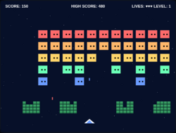
</a>

- Features: start screen, 3 lives, score, high-score, sound.
- Bugs: none found
- Graphics: Sprites and font seem 'blocky'. Smooth animation. Starfield parallax.
- Comments: Very playable, more than good enough.

### Experiment <a href="https://github.com/DrMicrobit/lllm_suit/blob/main/tests/03_SpaceInvaders_ddoc01/online/sonnet45/t2">tests/03_SpaceInvaders_ddoc01/online/sonnet45/t2</a>

<a href="https://drmicrobit.github.io/lllm_suit/tests/03_SpaceInvaders_ddoc01/online/sonnet45/t2/space_invaders.html">
  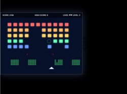
</a>

Initial version 2:04 --> When I open the file in the browser, I only see a dark screen and a blue rectangle, nothing else (no text, no nothing). Also, cannot start game, no reaction to key presses.

Fixed in 1:54. Then --> The player can shoot only once, afterwards not shots are fired.

Fixed in ~0:10. Did not ask to resolve remaining problems.

- Features: start screen, game over, 3 lives, score, high-score, sound.
- Bugs: display is small and not centered in browser. When aliens reach bottom, not immediate game over but successively killing remaining ships.
- Graphics: simplistic, but animated aliens. Smooth animation. Starfield parallax.
- Comments: Playable, good enough.

## Local model experiments for Space Invaders

### Experiment <a href="https://github.com/DrMicrobit/lllm_suit/blob/main/tests/03_SpaceInvaders_ddoc01/local/devstral-24B-ollama/4bit_t1">tests/03_SpaceInvaders_ddoc01/local/devstral-24B-ollama/4bit_t1</a>

<a href="https://drmicrobit.github.io/lllm_suit/tests/03_SpaceInvaders_ddoc01/local/devstral-24B-ollama/4bit_t1/space_invaders.html">
  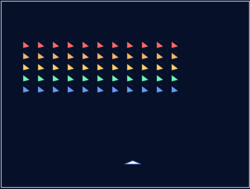
</a>

Needed to reduce context to 30k to let it run in VRAM.

Still very slow, ~7:30 minutes, for a comparatively small 20 KiB file.

Buggy (objects almost don't move), completely overloads the browser in terms of CPU.

Stopped experiment here.

### Experiment <a href="https://github.com/DrMicrobit/lllm_suit/blob/main/tests/03_SpaceInvaders_ddoc01/local/glm-z1-32B-0414-lmstudio/4bit_t1">tests/03_SpaceInvaders_ddoc01/local/glm-z1-32B-0414-lmstudio/4bit_t1</a>

<a href="https://drmicrobit.github.io/lllm_suit/tests/03_SpaceInvaders_ddoc01/local/glm-z1-32B-0414-lmstudio/4bit_t1/space_invaders.html">
  
</a>

Complete fail.
1. Even when restricting context window to 30k tokens, the model spilled over to RAM (~5 GiB) and CPU. Despite having ~3 GiB VRAM free on each card (~6 GiB total). Maybe more an Ollama problem.
2. Tool calling seems to fail, cline cannot parse the output in a way that allows meaningful interaction. No index.html created.
### Experiment <a href="https://github.com/DrMicrobit/lllm_suit/blob/main/tests/03_SpaceInvaders_ddoc01/local/nemotron-nano-9B-v2-bartowski/8bit_t1">tests/03_SpaceInvaders_ddoc01/local/nemotron-nano-9B-v2-bartowski/8bit_t1</a>

<a href="https://drmicrobit.github.io/lllm_suit/tests/03_SpaceInvaders_ddoc01/local/nemotron-nano-9B-v2-bartowski/8bit_t1/space_invaders.html">
  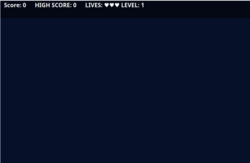
</a>

First round a total failure. Model rambling forever ("Wait, maybe the user meant ..."), destroying previously written code.

Experiment stopped after 10 minutes.

Next trial with following prompt: Implement the game given in @/designdoc.md . Do not ask the user if not absolutely necessary, follow the hits given by the agent.

Produced syntactically wrong code after 3 or 4 minutes ("if (AABB collision(bullet, target)) { ..."). Trying to fix that ... led to the thing spiraling out of control, adding free flow text into code, which led to further syntax errors which it could not fix and so on.

Stopped experiment after 50 minutes.
### Experiment <a href="https://github.com/DrMicrobit/lllm_suit/blob/main/tests/03_SpaceInvaders_ddoc01/local/qwen3-30B-a3b-instruct-2507-lmstudio/4bit_t1">tests/03_SpaceInvaders_ddoc01/local/qwen3-30B-a3b-instruct-2507-lmstudio/4bit_t1</a>

<a href="https://drmicrobit.github.io/lllm_suit/tests/03_SpaceInvaders_ddoc01/local/qwen3-30B-a3b-instruct-2507-lmstudio/4bit_t1/space_invaders.html">
  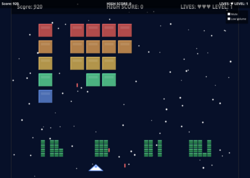
</a>

Initial version 4:37. Similar error to equivalent Ollama model: no invaders drwan. And similar reason: some mix-ups. Non-existing CONFIG.INVADER_ROWS and _COLUMNS, but also gameState.invaderRows and .invaderColumns.

Once fixed manually, further bugs:
- aliens don't move
- player shots not centered on player ship
- player shots do not destroy bunker blocks
- duplicated HUD elements

Tried bug fixing --> The aliens are not moving.

Leads to looping cline API calls (like this and similar): "Cline wants to search this directory for `move.*?invaders.*?update`:", seemingly forever

Stopping experiment here.
### Experiment <a href="https://github.com/DrMicrobit/lllm_suit/blob/main/tests/03_SpaceInvaders_ddoc01/local/qwen3-30B-a3b-instruct-2507-lmstudio/6bit_t1">tests/03_SpaceInvaders_ddoc01/local/qwen3-30B-a3b-instruct-2507-lmstudio/6bit_t1</a>

<a href="https://drmicrobit.github.io/lllm_suit/tests/03_SpaceInvaders_ddoc01/local/qwen3-30B-a3b-instruct-2507-lmstudio/6bit_t1/space_invaders.html">
  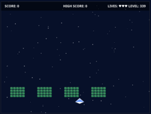
</a>

Initial version 5:07. Exactly same problem as 4 bit version and Ollama 4 bit version: accessing non-existing dictionary entries.

Additional bugs:
- player shots go down, not up
- alien shots do not destroy bunker

Stopped experiment.
### Experiment <a href="https://github.com/DrMicrobit/lllm_suit/blob/main/tests/03_SpaceInvaders_ddoc01/local/qwen3-30B-a3b-ollama/4bit_t1">tests/03_SpaceInvaders_ddoc01/local/qwen3-30B-a3b-ollama/4bit_t1</a>

<a href="https://drmicrobit.github.io/lllm_suit/tests/03_SpaceInvaders_ddoc01/local/qwen3-30B-a3b-ollama/4bit_t1/space_invaders.html">
  
</a>

Initial version 27 minutes. Tried incremental approach, lots of partial rewrites.

Complete fail. No menu, does not react to key presses.

Stopped experiment.

### Experiment <a href="https://github.com/DrMicrobit/lllm_suit/blob/main/tests/03_SpaceInvaders_ddoc01/local/qwen3-30B-instruct-ollama/4bit_t1">tests/03_SpaceInvaders_ddoc01/local/qwen3-30B-instruct-ollama/4bit_t1</a>

<a href="https://drmicrobit.github.io/lllm_suit/tests/03_SpaceInvaders_ddoc01/local/qwen3-30B-instruct-ollama/4bit_t1/space_invaders.html">
  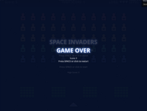
</a>

Initial version 5:02 minutes. Does not start. --> When opening the file index.html in browser, I see a Game Over screen with the text "Press space or click to restart". Neither pressing space nor clicking starts the game. Also, shouldn't the game start with the title screen?

Cline / model got stuck in neverending loop. Multiple messages "The model used search patterns that don't match anything in the file.", each after 5 minutes.

Stopped experiment.

### Experiment <a href="https://github.com/DrMicrobit/lllm_suit/blob/main/tests/03_SpaceInvaders_ddoc01/local/qwen3-30B-instruct-ollama/4bit_t2">tests/03_SpaceInvaders_ddoc01/local/qwen3-30B-instruct-ollama/4bit_t2</a>

<a href="https://drmicrobit.github.io/lllm_suit/tests/03_SpaceInvaders_ddoc01/local/qwen3-30B-instruct-ollama/4bit_t2/space_invaders.html">
  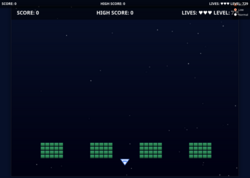
</a>

Initial version 4:53. No invaders, levels count up by the tenth of the second. --> When starting game, no invaders are drawn. Please fix.

Same problem as in t1: "The model used search patterns that don't match anything in the file. Retrying..." Then endless loop of trying and trying again.

Programming / logic error of the model: INVADER_ROWS and INVADER_COLS were not defined in CONFIG, leading to no invaders being created. D'oh.

When fixing the bug by hand, game starts bug several other bugs appear: player cannot shoot, alien shots go through bunker, etc.

Stopping this experiment.
### Experiment <a href="https://github.com/DrMicrobit/lllm_suit/blob/main/tests/03_SpaceInvaders_ddoc01/local/qwen3-coder-30B-cerebrasreap25B/4bit_t1">tests/03_SpaceInvaders_ddoc01/local/qwen3-coder-30B-cerebrasreap25B/4bit_t1</a>

<a href="https://drmicrobit.github.io/lllm_suit/tests/03_SpaceInvaders_ddoc01/local/qwen3-coder-30B-cerebrasreap25B/4bit_t1/space_invaders.html">
  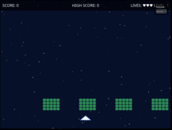
</a>

Initial version 8:25 (went through 1 rewrite, why?).

Bugs:
- no alien formation
- game freezes when player shoots

Too buggy, stopping experiment.

### Experiment <a href="https://github.com/DrMicrobit/lllm_suit/blob/main/tests/03_SpaceInvaders_ddoc01/local/qwen3-coder-30B-cerebrasreap25B/4bit_t2">tests/03_SpaceInvaders_ddoc01/local/qwen3-coder-30B-cerebrasreap25B/4bit_t2</a>

<a href="https://drmicrobit.github.io/lllm_suit/tests/03_SpaceInvaders_ddoc01/local/qwen3-coder-30B-cerebrasreap25B/4bit_t2/space_invaders.html">
  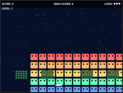
</a>

Initial version 3:53. Typical Qwen sliding bug fixed by hand. Still problem: alien formation does not reverse direction at border (logic bug, direction is only a local variable) --> When reaching border, the alien formation does not reverse direction.

Not fixed, 2:47. Trying --> When reaching border, the alien formation does not reverse direction.

2:17. Not fixed. Stopping experiment.

### Experiment <a href="https://github.com/DrMicrobit/lllm_suit/blob/main/tests/03_SpaceInvaders_ddoc01/local/qwen3-coder-30B-cerebrasreap25B/4bit_t3">tests/03_SpaceInvaders_ddoc01/local/qwen3-coder-30B-cerebrasreap25B/4bit_t3</a>

<a href="https://drmicrobit.github.io/lllm_suit/tests/03_SpaceInvaders_ddoc01/local/qwen3-coder-30B-cerebrasreap25B/4bit_t3/space_invaders.html">
  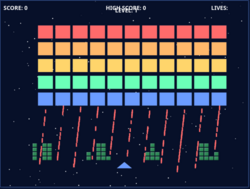
</a>

Initial version 3:47. In a funny way buggy as hell, stopping experiment here.

### Experiment <a href="https://github.com/DrMicrobit/lllm_suit/blob/main/tests/03_SpaceInvaders_ddoc01/local/qwen3-coder-30B-cerebrasreap25B/6bitxl_t1">tests/03_SpaceInvaders_ddoc01/local/qwen3-coder-30B-cerebrasreap25B/6bitxl_t1</a>

<a href="https://drmicrobit.github.io/lllm_suit/tests/03_SpaceInvaders_ddoc01/local/qwen3-coder-30B-cerebrasreap25B/6bitxl_t1/space_invaders.html">
  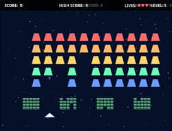
</a>

Intial 4:16. Actually quite good, just the laser-like fire is a misstep. --> The player can shoot continuously, with dozens and dozens of bullets. Make sure there can be at most one player bullet.

Fixed in 0:30.

Remaining bugs:
- shadow displays of score, high-score etc.
- UFO cannot be killed

Graphics simple, but functional. Very playable.
### Experiment <a href="https://github.com/DrMicrobit/lllm_suit/blob/main/tests/03_SpaceInvaders_ddoc01/local/qwen3-coder-30B-cerebrasreap25B/6bitxl_t2">tests/03_SpaceInvaders_ddoc01/local/qwen3-coder-30B-cerebrasreap25B/6bitxl_t2</a>

<a href="https://drmicrobit.github.io/lllm_suit/tests/03_SpaceInvaders_ddoc01/local/qwen3-coder-30B-cerebrasreap25B/6bitxl_t2/space_invaders.html">
  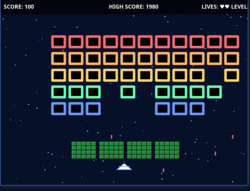
</a>

4:02 initial version. Slide error, partially fixed by hand. -> Aliens are not shooting, and the player should be killed if the lowest alien reaches his position.

Fixed in 4:30.

Good enough, but still buggy.

Bugs remaining:
- still sometimes sliding error.
- alien shots traverse bunkers
### Experiment <a href="https://github.com/DrMicrobit/lllm_suit/blob/main/tests/03_SpaceInvaders_ddoc01/local/qwen3-coder-30B-cerebrasreap25B/6bitxl_t3">tests/03_SpaceInvaders_ddoc01/local/qwen3-coder-30B-cerebrasreap25B/6bitxl_t3</a>

<a href="https://drmicrobit.github.io/lllm_suit/tests/03_SpaceInvaders_ddoc01/local/qwen3-coder-30B-cerebrasreap25B/6bitxl_t3/space_invaders.html">
  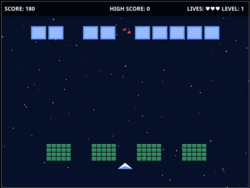
</a>

Initial version 4:16. Not that great: alien placement bug, formation not moving.

Did not debug.

Nice: particle effect when hitting alien.
### Experiment <a href="https://github.com/DrMicrobit/lllm_suit/blob/main/tests/03_SpaceInvaders_ddoc01/local/qwen3-coder-30B-cerebrasreap25B/6bitxl_t4">tests/03_SpaceInvaders_ddoc01/local/qwen3-coder-30B-cerebrasreap25B/6bitxl_t4</a>

<a href="https://drmicrobit.github.io/lllm_suit/tests/03_SpaceInvaders_ddoc01/local/qwen3-coder-30B-cerebrasreap25B/6bitxl_t4/space_invaders.html">
  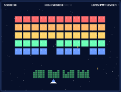
</a>

Initial version 5:34

Buggy as hell: sound weird. Game freezes after a few seconds.

Did not debug.


### Experiment <a href="https://github.com/DrMicrobit/lllm_suit/blob/main/tests/03_SpaceInvaders_ddoc01/local/qwen3-coder-30B-cerebrasreap25B/6bitxl_t5">tests/03_SpaceInvaders_ddoc01/local/qwen3-coder-30B-cerebrasreap25B/6bitxl_t5</a>

<a href="https://drmicrobit.github.io/lllm_suit/tests/03_SpaceInvaders_ddoc01/local/qwen3-coder-30B-cerebrasreap25B/6bitxl_t5/space_invaders.html">
  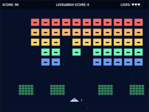
</a>

Initial version 4:07. --> The following bugs need fixing: 1. bunker blocks are not destryed, neither by player shots nor alien shots

Partly fixed in 3:23. --> Now player shots destroy bunker blocks, but alien shots do not.

Fixed in 1:15. --> Player shots often pass through aliens. Sometimes they destroy the aliens, sometimes not.

Fixed in ~5 minutes. --> The fire function of the player is unreliable. Most of the time it works, but as the game progresses, it becomes more and more unreliable. To the point where pressing the space bar 10 times and more does not produce a single shot.

Not fixed, 3:34. --> Problem is not fixed. Please rewrite entire input logic using another approach.

Took 2:07. Better, but not entirely fixed. Stopping experiment here.

Remaining bugs:
- on rare occasions typical "slide down of alien formation" problem of Qwen3-coder
- player shooting unreliable
### Experiment <a href="https://github.com/DrMicrobit/lllm_suit/blob/main/tests/03_SpaceInvaders_ddoc01/local/qwen3-coder-30B-cerebrasreap25B/6bitxl_t6">tests/03_SpaceInvaders_ddoc01/local/qwen3-coder-30B-cerebrasreap25B/6bitxl_t6</a>

<a href="https://drmicrobit.github.io/lllm_suit/tests/03_SpaceInvaders_ddoc01/local/qwen3-coder-30B-cerebrasreap25B/6bitxl_t6/space_invaders.html">
  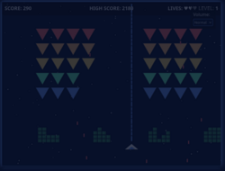
</a>

Initial version 4:16. Lots of bugs (visuals, gameplay), stopping here.

### Experiment <a href="https://github.com/DrMicrobit/lllm_suit/blob/main/tests/03_SpaceInvaders_ddoc01/local/qwen3-coder-30B-ollama/4bit_t1">tests/03_SpaceInvaders_ddoc01/local/qwen3-coder-30B-ollama/4bit_t1</a>

<a href="https://drmicrobit.github.io/lllm_suit/tests/03_SpaceInvaders_ddoc01/local/qwen3-coder-30B-ollama/4bit_t1/space_invaders.html">
  
</a>

- initial 3:59. When opening the file in browser, I do not see a possibility to start the game.
- fix in 0:59 --> Aliens don't shoot?
- fix in 2:30 --> Only the blocks of the leftmost bunker are destroyed by shots? Shots go through the other bunkers.
- fix in 2:25 --> the score is shown as Nan?
- fix in 4:04.

Remaining bugs:
- main menu has "Game Over" text and restart button
- player ship hitbox too small (only blue triangle)
- some display elements overlapping
- no restart after game over.

- Features: start screen, no game over screen, 3 lives, score, high-score, sound.
- Bugs: Minor, see above.
- Graphics: nice shapes, though not animated. Starfield parallax.
- Comments: very playable, but needed a few debug rounds.

### Experiment <a href="https://github.com/DrMicrobit/lllm_suit/blob/main/tests/03_SpaceInvaders_ddoc01/local/qwen3-coder-30B-ollama/4bit_t2">tests/03_SpaceInvaders_ddoc01/local/qwen3-coder-30B-ollama/4bit_t2</a>

<a href="https://drmicrobit.github.io/lllm_suit/tests/03_SpaceInvaders_ddoc01/local/qwen3-coder-30B-ollama/4bit_t2/space_invaders.html">
  
</a>

After 3 minutes: broken HTML file. Then *The model used search patterns that don't match anything in the file. Retrying..."

*Then API Request failed*

Stopped experiment

### Experiment <a href="https://github.com/DrMicrobit/lllm_suit/blob/main/tests/03_SpaceInvaders_ddoc01/local/qwen3-coder-30B-ollama/4bit_t3">tests/03_SpaceInvaders_ddoc01/local/qwen3-coder-30B-ollama/4bit_t3</a>

<a href="https://drmicrobit.github.io/lllm_suit/tests/03_SpaceInvaders_ddoc01/local/qwen3-coder-30B-ollama/4bit_t3/space_invaders.html">
  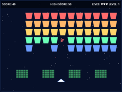
</a>

Initial 4:03 --> player can not move left or right with keyboard, just mouse
- 2nd iteration (1:20) --> still same problem
- 3rd it (2:54) same problem

Stopped experiment.

Graphics looks simplistic, but nice. Particle effect for exploding aliens.
### Experiment <a href="https://github.com/DrMicrobit/lllm_suit/blob/main/tests/03_SpaceInvaders_ddoc01/local/qwen3-coder-30B-ollama/4bit_t4">tests/03_SpaceInvaders_ddoc01/local/qwen3-coder-30B-ollama/4bit_t4</a>

<a href="https://drmicrobit.github.io/lllm_suit/tests/03_SpaceInvaders_ddoc01/local/qwen3-coder-30B-ollama/4bit_t4/space_invaders.html">
  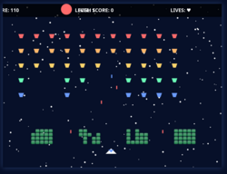
</a>

Initial version took 3:24 minutes -->  When the invaders reach a border, they don't drop down by only one row, but immediately slide down to player level, leading to a game over.

- for the above error: ~10 trials (2-3 minutes each) could not solve problem.
- problem was a logic bug of alien movement, that kept invaders at same x-position, therefore immediately sliding down.
- manual fix, then continue. --> Player shots do not destroy bunker blocks
- 2:37 --> Bunkers are not restored on on start of new wave.
- 0:45 -- fixed

Still couple of bugs present: display placement, hit boxes not 100% accurate, UFO cannot be destroyed, but stopping here.

- Features: start screen, game over screen, 3 lives, score, high-score, sound.
- Bugs: Major, needed manual bugfix. Remaining minor. See above.
- Graphics: simplistic shapes, animated. Starfield parallax.
- Comments: very playable, but needed a few debug rounds.

### Experiment <a href="https://github.com/DrMicrobit/lllm_suit/blob/main/tests/03_SpaceInvaders_ddoc01/local/qwen3-coder-30B-ollama/4bit_t5">tests/03_SpaceInvaders_ddoc01/local/qwen3-coder-30B-ollama/4bit_t5</a>

<a href="https://drmicrobit.github.io/lllm_suit/tests/03_SpaceInvaders_ddoc01/local/qwen3-coder-30B-ollama/4bit_t5/space_invaders.html">
  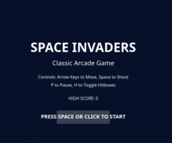
</a>

Initial 3:15 --> The title screen appears, but pressing space or clicking leads to no reaction.
- 1:46 --> still same problem
- 1:12 --> again, stopped experiment

### Experiment <a href="https://github.com/DrMicrobit/lllm_suit/blob/main/tests/03_SpaceInvaders_ddoc01/local/qwen3-coder-30B-ollama/4bit_t6">tests/03_SpaceInvaders_ddoc01/local/qwen3-coder-30B-ollama/4bit_t6</a>

<a href="https://drmicrobit.github.io/lllm_suit/tests/03_SpaceInvaders_ddoc01/local/qwen3-coder-30B-ollama/4bit_t6/space_invaders.html">
  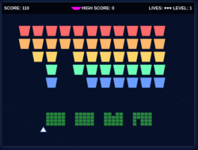
</a>

Initial run was caught in neverending loop. Stopped after 8 minutes.

New fresh run: 3:45 for initial version. Old problem of invaders moving to bottom of screen fixed manually. Then "Most shots of the player don't kill the aliens bit go right through."

- fixed in 2:29. Then --> The player ship does not react to key presses that should move it left or right. It only shoots with space. (mouse control works fine)
- Two trials, 3 minutes and 7 minutes, did not fix the problem

Other bugs: starfield; aliens move too much down before killing player

Ended experiment.

### Experiment <a href="https://github.com/DrMicrobit/lllm_suit/blob/main/tests/03_SpaceInvaders_ddoc01/local/qwen3-coder-30B-unsloth/4bit_t1">tests/03_SpaceInvaders_ddoc01/local/qwen3-coder-30B-unsloth/4bit_t1</a>

<a href="https://drmicrobit.github.io/lllm_suit/tests/03_SpaceInvaders_ddoc01/local/qwen3-coder-30B-unsloth/4bit_t1/space_invaders.html">
  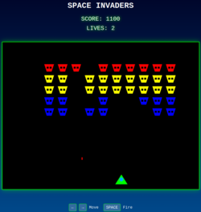
</a>

initial version 1:41.

Playable, but many things not implemented:
- bunkers
- resticted shots (player has laser like)
- starfield
- highscore
- sound

Did not continue experiment.
### Experiment <a href="https://github.com/DrMicrobit/lllm_suit/blob/main/tests/03_SpaceInvaders_ddoc01/local/qwen3-coder-30B-unsloth/4bit_t2">tests/03_SpaceInvaders_ddoc01/local/qwen3-coder-30B-unsloth/4bit_t2</a>

<a href="https://drmicrobit.github.io/lllm_suit/tests/03_SpaceInvaders_ddoc01/local/qwen3-coder-30B-unsloth/4bit_t2/space_invaders.html">
  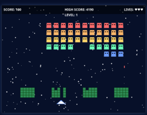
</a>

Intial version 4:20. Had "typical down slide error." Fixed manually. Then manually reduced size of aliens from 48x40 to 32x28. Then: "Player shots do not destroy bunker blocks. And bunkers are not reset at beginning of each wave."


- fixed in 3:08.

Very playable, stopped experiment. Remaining problems: no restart, low alien shot frequency.
### Experiment <a href="https://github.com/DrMicrobit/lllm_suit/blob/main/tests/03_SpaceInvaders_ddoc01/local/qwen3-coder-30B-unsloth/4bitUD_t1">tests/03_SpaceInvaders_ddoc01/local/qwen3-coder-30B-unsloth/4bitUD_t1</a>

<a href="https://drmicrobit.github.io/lllm_suit/tests/03_SpaceInvaders_ddoc01/local/qwen3-coder-30B-unsloth/4bitUD_t1/space_invaders.html">
  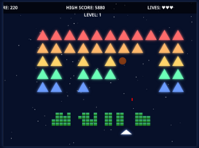
</a>

Initial version 3:23. Typical "enemy slide down problem", semi-fixed by hand. Then: "Player shots do not destroy bunker blocks."

- Fix in 1:02.

Very playable. Remaining bugs: some display placements.

### Experiment <a href="https://github.com/DrMicrobit/lllm_suit/blob/main/tests/03_SpaceInvaders_ddoc01/local/qwen3-coder-30B-unsloth/4bitUD_t2">tests/03_SpaceInvaders_ddoc01/local/qwen3-coder-30B-unsloth/4bitUD_t2</a>

<a href="https://drmicrobit.github.io/lllm_suit/tests/03_SpaceInvaders_ddoc01/local/qwen3-coder-30B-unsloth/4bitUD_t2/space_invaders.html">
  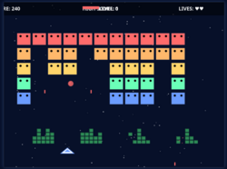
</a>

Initial version 3:23. All movements are almost imperceptibly slow: aliens, player ship, player shots etc.

- Fixed in it 7:55. Then typical slide down error, fixed manually.

Very playable.

Remnaining bugs:
- only one wave, then automatic restart
- sound in game over screen
- nitpick: no starfield parallax
### Experiment <a href="https://github.com/DrMicrobit/lllm_suit/blob/main/tests/03_SpaceInvaders_ddoc01/local/qwen3-coder-30B-unsloth/6bitUD_t1">tests/03_SpaceInvaders_ddoc01/local/qwen3-coder-30B-unsloth/6bitUD_t1</a>

<a href="https://drmicrobit.github.io/lllm_suit/tests/03_SpaceInvaders_ddoc01/local/qwen3-coder-30B-unsloth/6bitUD_t1/space_invaders.html">
  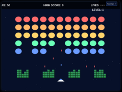
</a>

Initial version: 35 minutes. (because model overspilled to CPU)

Almost perfect?!? The starfield is scintillating instead of parallax, but apart from that ... ooof.

Sound a bit harsh.
### Experiment <a href="https://github.com/DrMicrobit/lllm_suit/blob/main/tests/03_SpaceInvaders_ddoc01/local/qwen3-coder-30B-unsloth/6bitUD_t2">tests/03_SpaceInvaders_ddoc01/local/qwen3-coder-30B-unsloth/6bitUD_t2</a>

<a href="https://drmicrobit.github.io/lllm_suit/tests/03_SpaceInvaders_ddoc01/local/qwen3-coder-30B-unsloth/6bitUD_t2/space_invaders.html">
  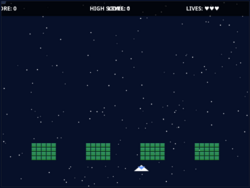
</a>

Initial version: 31 minutes (overspill to CPU) --> When I start the game. the aliens seem to be off-screen. Also, player shots do not destroy bunker blocks. Also, no sound though the title screen says the sound is on.

- 32 minutes. Sound there, but still no aliens. --> The aliens are still not visible when starting a wave. Rewrite the whole initial placement of an alien wave.
- 8 minutes --> not the problem. "Apparently the aliens are all at position 0 after moving."

Stopped experiment.
### Experiment <a href="https://github.com/DrMicrobit/lllm_suit/blob/main/tests/03_SpaceInvaders_ddoc01/local/qwen3-coder-30B-unsloth/6bitUD_t3">tests/03_SpaceInvaders_ddoc01/local/qwen3-coder-30B-unsloth/6bitUD_t3</a>

<a href="https://drmicrobit.github.io/lllm_suit/tests/03_SpaceInvaders_ddoc01/local/qwen3-coder-30B-unsloth/6bitUD_t3/space_invaders.html">
  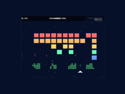
</a>

Initial version 35 mins (overspill to CPU). "Classic" alien sliding bug fixed by hand.

Result very playable, bit low alien shoot frequency, not many bugs left:
- display element placement
- start only via click, not via space

Leaving as is.
### Experiment <a href="https://github.com/DrMicrobit/lllm_suit/blob/main/tests/03_SpaceInvaders_ddoc01/local/qwen3-coder-30B-unsloth/6bitUD_t4">tests/03_SpaceInvaders_ddoc01/local/qwen3-coder-30B-unsloth/6bitUD_t4</a>

<a href="https://drmicrobit.github.io/lllm_suit/tests/03_SpaceInvaders_ddoc01/local/qwen3-coder-30B-unsloth/6bitUD_t4/space_invaders.html">
  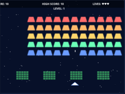
</a>

Reduced context to 48 Ki to run in VRAM.

3:52 initial version. Game freezes. Decided to go console route --> I get the following error on the console: Uncaught TypeError: can't access property "x", gameState.playerBullet is null
    update index.html:465
    loop index.html:837

Model answered with:
```
I need to fix the error in the collision detection code. The issue is that the code is trying to access properties of gameState.playerBullet when it's null. Let me fix this by adding proper null checks.
```

**Argh!**, no not what should be done.

And ... same problem occurs again. Stopping experiment here.

### Experiment <a href="https://github.com/DrMicrobit/lllm_suit/blob/main/tests/03_SpaceInvaders_ddoc01/local/qwen3-coder-30B-unsloth/6bitUD_t5">tests/03_SpaceInvaders_ddoc01/local/qwen3-coder-30B-unsloth/6bitUD_t5</a>

<a href="https://drmicrobit.github.io/lllm_suit/tests/03_SpaceInvaders_ddoc01/local/qwen3-coder-30B-unsloth/6bitUD_t5/space_invaders.html">
  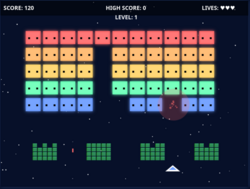
</a>

Reduced context to 48 Ki to run in VRAM.

4:30 for initial version. Typical Qwen slide-bug, fixed by hand. But: random freeze. Console: Uncaught TypeError: can't access property "x", invaderBullets[i] is undefined
    update index.html:755
    loop index.html:1035

Logic error in bunker block collision detection from alien shots. Similar a bit to t4.

Fixed by hand, but stopped here.

Remaining bugs:
- player has laserlike autofire
- player shots do not destroy bunker

### Experiment <a href="https://github.com/DrMicrobit/lllm_suit/blob/main/tests/03_SpaceInvaders_ddoc01/local/qwen3-coder-30B-yoyolin/4bit_t1">tests/03_SpaceInvaders_ddoc01/local/qwen3-coder-30B-yoyolin/4bit_t1</a>

<a href="https://drmicrobit.github.io/lllm_suit/tests/03_SpaceInvaders_ddoc01/local/qwen3-coder-30B-yoyolin/4bit_t1/space_invaders.html">
  
</a>

Model doesn't play well with Cline.

Chatty beyond belief, but builds up file bit by bit,
functionality by functionality.

Result however is a minuscule file, completely broken.

Stopping here.

### Experiment <a href="https://github.com/DrMicrobit/lllm_suit/blob/main/tests/03_SpaceInvaders_ddoc01/local/skyfall-31B-v4-thedrummer/4bit_t1">tests/03_SpaceInvaders_ddoc01/local/skyfall-31B-v4-thedrummer/4bit_t1</a>

<a href="https://drmicrobit.github.io/lllm_suit/tests/03_SpaceInvaders_ddoc01/local/skyfall-31B-v4-thedrummer/4bit_t1/space_invaders.html">
  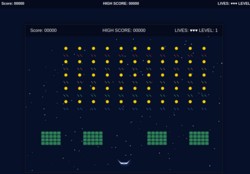
</a>

Very slow model. Also needed to reduce context to 30k to fit to VRAM.

Initial version 23:30 minutes. Game does not work. Different error messages on console (RangeError Audio and ReferenceError in the drawInvader and drawBunker functions).

Logic error between caller and drawInvaders and drawBunker functions, solved by manual fix.

Bugs:
- no sound
- invaders look weird
- invaders don't shoot
- player cannot move or shoot
- HUD displays are doubled

Stopped experiment.
### Experiment <a href="https://github.com/DrMicrobit/lllm_suit/blob/main/tests/03_SpaceInvaders_ddoc01/local/skyfall-31B-v4-thedrummer/4bit_t2">tests/03_SpaceInvaders_ddoc01/local/skyfall-31B-v4-thedrummer/4bit_t2</a>

<a href="https://drmicrobit.github.io/lllm_suit/tests/03_SpaceInvaders_ddoc01/local/skyfall-31B-v4-thedrummer/4bit_t2/space_invaders.html">
  
</a>

75 minutes! And completely broken.

Forget it.
