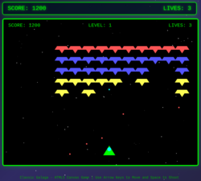
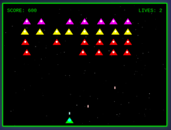
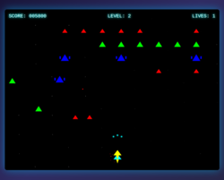
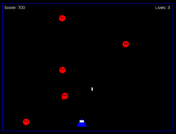
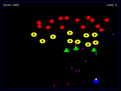
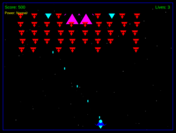

## Models tested

Online models I tested (via web interfaces) to establish a base line:

- Gemini 2.5 Pro versions
- GPT5
- Sonnet 4.5
- Qwen 3 coder and Qwen 3 max

When the models had a reasoning effort available, I set it to "high".

Local models:

- [Qwen3-coder 30B](https://ollama.com/library/qwen3-coder) as delivered by Ollama by
  default. That is a 4 bit quantisation
  model and allows me to have a bit more than 96k tokens of context on my 32 GiB VRAM

- [Qwen3-Coder-30B-A3B-Instruct](https://huggingface.co/unsloth/Qwen3-Coder-30B-A3B-Instruct-GGUF) in 2, 3, and 4 bit quantisation from unsloth@huggingface.  
  I also threw in their "UD 4 bit XL" model. UD stands for "Unsloth Dynamic", a special
  kind of quantisation reduction they claim produces better results than other methods.

## Why Galaga?

Contrary to Space Invaders, I suspect there are a lot less examples online regarding Galaga.

<!-- Everything below this line is generated automatically, do not change -->

## Online model experiments for Galaga

### Experiment <a href="https://github.com/DrMicrobit/lllm_suit/blob/main/tests/Galaga/online/Gemini25pro/t1">tests/Galaga/online/Gemini25pro/t1</a>

Almost a "Space Invaders"
Smooth player and alien anim.
Bugs:
- very little alien shots
- very little alien attacks
- aliens don't move after a game over.

### Experiment <a href="https://github.com/DrMicrobit/lllm_suit/blob/main/tests/Galaga/online/Gemini25pro/t2">tests/Galaga/online/Gemini25pro/t2</a>

Not a Galaga game, but "Space Invaders"
Smooth player and alien anim.
A bit of a bullet hell.
### Experiment <a href="https://github.com/DrMicrobit/lllm_suit/blob/main/tests/Galaga/online/GPT5/t1">tests/Galaga/online/GPT5/t1</a>

Almost Galaga.
Very nice graphics, smooth anims. Sound.
Bugs:
- enemies in attack go to random position after attack if they did not reach bottom of screen
- clearing the first wave, gane jumps to wave 49 or 50
- some enemies in later waves outside screen
### Experiment <a href="https://github.com/DrMicrobit/lllm_suit/blob/main/tests/Galaga/online/GPT5/t2">tests/Galaga/online/GPT5/t2</a>

Almost Galaga.
Very nice graphics, smooth anims. Sound.
Bugs:
- player lives do not decrease
- some UI elements overlap playing field
- absolute bullet hell
- Sound not on by default
### Experiment <a href="https://github.com/DrMicrobit/lllm_suit/blob/main/tests/Galaga/online/Qwen3coder/t1">tests/Galaga/online/Qwen3coder/t1</a>

Not Galaga, but Space Invaders.
Smooth anims, particle explosions.

### Experiment <a href="https://github.com/DrMicrobit/lllm_suit/blob/main/tests/Galaga/online/Qwen3coder/t2">tests/Galaga/online/Qwen3coder/t2</a>

Not Galaga, but Space Invaders.
Jagged alien movement.
Bugs:
- does not restart correctly after a game over

### Experiment <a href="https://github.com/DrMicrobit/lllm_suit/blob/main/tests/Galaga/online/Qwen3coder/t3">tests/Galaga/online/Qwen3coder/t3</a>

Not Galaga, but Space Invaders.
Smooth animations.
Bugs:
- some UI elements overlap player
- a bit bullet hell

### Experiment <a href="https://github.com/DrMicrobit/lllm_suit/blob/main/tests/Galaga/online/Qwen3Max/t1">tests/Galaga/online/Qwen3Max/t1</a>

Not Galaga, but Space Invaders
Bugs:
- alien movement logic (game breaking)
- bullet hell
### Experiment <a href="https://github.com/DrMicrobit/lllm_suit/blob/main/tests/Galaga/online/Qwen3Max/t2">tests/Galaga/online/Qwen3Max/t2</a>

Mixture of Space Invaders and Galaga
Smooth animations, sound.
Has sort of double ship, triple shots upgrade mechanics.
Bugs:
- first iteration had a game breaking freeze when player picked up additional ship, needed additional bugfixing round
### Experiment <a href="https://github.com/DrMicrobit/lllm_suit/blob/main/tests/Galaga/online/Sonnet45/t1">tests/Galaga/online/Sonnet45/t1</a>

Almost Galaga, albeit simplistic.
Smooth retrographics, particle animation explosions.
Bugs:
- alien attack movement logic

### Experiment <a href="https://github.com/DrMicrobit/lllm_suit/blob/main/tests/Galaga/online/Sonnet45/t2">tests/Galaga/online/Sonnet45/t2</a>

Almost Galaga, albeit simplistic.
Smooth retrographics, particle animation explosions.
Bugs:
- restart game after game over does not work
- stars in starfield are in diaginal lines

## Local model experiments for Galaga

### Experiment <a href="https://github.com/DrMicrobit/lllm_suit/blob/main/tests/Galaga/local/qwen3-coder-30B-ollama/4bit_t1">tests/Galaga/local/qwen3-coder-30B-ollama/4bit_t1</a>

### Experiment <a href="https://github.com/DrMicrobit/lllm_suit/blob/main/tests/Galaga/local/qwen3-coder-30B-ollama/4bit_t2">tests/Galaga/local/qwen3-coder-30B-ollama/4bit_t2</a>

Not a space invaders game, also not Galaga. More a Shoot Em Up.
Bugs:
- first iteration (1:07 minutes) resulted in non-functional game, needed bugfixing (50 seconds)
- some player shots do not connect with (kill) aliens

### Experiment <a href="https://github.com/DrMicrobit/lllm_suit/blob/main/tests/Galaga/local/qwen3-coder-30B-ollama/4bit_t3">tests/Galaga/local/qwen3-coder-30B-ollama/4bit_t3</a>

1st iteration (1:17 minutes): more or less a fail. Resulted in a straight Space Invaders.

2nd iteration (3:59 minutes): when pointing this out, model created again a Space Invaders, but with wavy alien movements. Plus, a bug that randomly freezes the game (unknown cause).

3rd to 5th iteration (~4 minutes each): the random freeze could not be fixed

Stopped experiment.

### Experiment <a href="https://github.com/DrMicrobit/lllm_suit/blob/main/tests/Galaga/local/qwen3-coder-30B-unsloth/4bit_t1">tests/Galaga/local/qwen3-coder-30B-unsloth/4bit_t1</a>

1st iteration: 47s. Space Invaders game. Bugs: restart after game over does not work. All enemies killed should trigger new wave but does not.

2nd iteration (endless loop): initial response came after 1:56 minutes, but contained non-HTML, non-JavaScript text ("++REPLACE"). Cline then went into endless loop trying to fix it. Manual stop and fix resulted in still Space Invaders game, with same bugs.

### Experiment <a href="https://github.com/DrMicrobit/lllm_suit/blob/main/tests/Galaga/local/qwen3-coder-30B-unsloth/4bitUD_t1">tests/Galaga/local/qwen3-coder-30B-unsloth/4bitUD_t1</a>

1st iteration (1:10): a Space Invaders Game. Buggy (enemies don't shoot, slow enemy movement)

2nd iteration (7:03): still a Space Invaders Game. Still no enemies hooting, still slow enemy movement.

Stopped experiment.

One reason for very long 2nd iteration could be incompatibility of model to what Clone expects. There were multiple message like the following "*The model used search patterns that don't match anything in the file. Retrying...*"

