# Building a Space Invaders game with AI, the YOLO approach

This experiment was run in a wing-it approach, similar to how many people imagine an LLM powered AI system can be used: without a lot of details, they expect the AI "to do the right thing." I will not go into a discussion on how different people define "the right thing" differently, let's just say that there are always different needs and assumptions in play.

This experiment used the following prompt: `Write a space invaders game, contained in a single HTML file.`

> [!IMPORTANT]
The TL;DR;: do not expect YOLO to give you what you imagined what you would get, not even with the big commercial models.

## Models tested

Online models I tested (via web interfaces) to establish a base line:

- Gemini 2.5 (Flash & Pro versions)
- GPT5
- Opus 4.1 & Sonnet 4.5
- Qwen 3 coder

When the models had a reasoning effort available, I set it to "high".

Local models:

- [Qwen3-coder 30B](https://ollama.com/library/qwen3-coder) as delivered by Ollama by
  default. That is a 4 bit quantisation
  model and allows me to have a bit more than 96k tokens of context on my 32 GiB VRAM

- [Qwen3-Coder-30B-A3B-Instruct](https://huggingface.co/unsloth/Qwen3-Coder-30B-A3B-Instruct-GGUF) in 2, 3, and 4 bit quantisation from unsloth@huggingface.  
  I also threw in their "UD 4 bit XL" model. UD stands for "Unsloth Dynamic", a special
  kind of quantisation reduction they claim produces better results than other methods.

## Why Space Invaders?

Several reasons:

1. the results can be easily visualised, and even non-technical people can
   quickly get an impression on what has been delivered. Both the positive and
   the negative aspects, and this is quite invaluable.
2. it's an age old gameplay mechanic. Examples for it should be findable all
   over the internet and one can be quite sure that models will have seen this
   both as textual description as well as code during learning.
3. it is a comparatively simple gameplay mechanic

## Unraveling implied specifications

There is an awful lot of intrinsic knowledge hidden in the small sentence given as task to the LLMs. Let's unravel it a bit.

If you've never seen Space Invaders, have a look at [this video](https://www.youtube.com/watch?v=MU4psw3ccUI) for a recording of one of the first arcade machines. See [this video](https://www.youtube.com/watch?v=kR2fjwr-TzA) for an example of slightly later version.

The model will need to know what a space invaders game is. Textually, a short definition of the core game play loop could be "a player ship at bottom of the screen shoots aliens who move top to down, themselves shooting at the player. When a wave of aliens has been cleared, the next wave appears. The player has 3 lives."

Specifically, the AI models need to know and/or define:

- how enemies
  - look like: d'oh ... like aliens, I presume?
  - are placed and how many there are: a rectangular grid as formation, maybe 40 - 60 aliens in 5 rows? (Note: the original arcade version had 55 aliens in 5 rows)
  - move: the whole formation moves horizontally left to right and back on screen, the whole formation reversing direction when an alien arrives at the border of the playing field. Also, when reversing direction, the formation moves down a row. Alien movement should look smooth on screen.
  - shoot: projectiles from aliens are spawned by the most bottom alien of a column and move straight down. Frequency of shots ... easy at first, becoming more difficult over time. But how would one quantify that?
- how the player
  - moves: only left and right on screen, stopping at borders of playing field
  - shoots: bottom to top, not in a continuous stream.
- additional playing field elements like cover
  - there are 4 evenly spaced protective element placed above the player which provide protection
- how projectiles behave on impact
  - projectiles of player can intercept alien projectiles. If it is a simple alien projectile, both the alien and the player projectiles disappear. If it is a strong alien projectile, only the player projectile disappears.
  - an alien projectile hitting player lets the player ship explode, player loses one life
  - a player projectile hitting an alien let's the alien explode and remove it from the formation
  - any projectile hitting a cover erodes part of the cover it hits
- additional elements displayed on screen like
  - player score and high-score. Which begs the question on how the score is computed, but let's not go into that level of detail now
  - player lives
- Sound would be nice?
  - when player shoots
  - when alien shoot
  - when projectiles connect
  - as alien formation moves
- Difficulty increase
  - the speed of the aliens is dependent of the number aliens which were shot in the current wave
- What happens when player lost all lives
- From time to time, a flying saucer traverses the screen at the top. The player can shoot it for extra points.

From the technical point of view, one would need to define a HTML page as container, possibly CSS elements for styling, and finally write JavaScript code for the game logic.

Note that the above is a very rough first draft of a requirements document
and is already 450 words long (3 Kb). A fully detailed document including technical specifications could easily be around 5 to 10x longer and is
something a business analyst or product manager / product owner would need to write together with stakeholders, technical leads, UX/UI designers, etc.pp

So, it's quite a bit of work and knowledge compressed into the simple sentence of `Write a space invaders game, contained in a single HTML file.`

## Results

### Results online models

While the large models gave runnable results pretty often, there was a wide range of smaller and larger bugs. The two biggest one being GPT5 and Qwen3-coder each had one of their initial versions with a coding error and the game not starting.

From features and gameplay, GPT5 clearly set itself apart from the other models. Both trials have sound, modern graphics with extras like particle explosions, aliens with extra wave movements and a playing field which adapts dynamically to browser window size.

From the look and feel, Gemini 2.5 pro also looked different than the other models: the aliens had a distinctive look, not only simple basic shapes. One version also had particle explosions.

Gemini 2.5 Flash, Opus 4.1, Sonnet 4.5, and Qwen 3 coder all had very similar look and feel with slight variations, mostly in color schemes.

Qwen and Gemini Flash had one thing in common: they often had difficulties with the animation. Often, the aliens moved very, very slowly. Although it is a trivial problem to fix when knowing where to look, I tried to have the models fix the problem by describing it as a user would do "the aliens are moving way too slow". The 'fixes' the models then implemented were suboptimal and led to jagged animations.

Sonnet, Opus, and Qwen also let alien projectiles start at any row within an alien formation instead of the most bottom alien.

### Results local models

I got astonishingly good results, at least for the 4 bit models, I was often able to get a working game with varying degrees of features. Sometimes the there were errors which needed to be corrected.

One can clearly see the relationship of the Qwen 30B model to the large online Qwen 3 coder model: the look and feel is very close, and also the problems (jagged animation, often laser-like firing) are almost identical.

I would not recommend using 3-bit models, and certainly not 2-bit models. One can clearly see a degradation of quality.

<!-- Everything below this line is generated automatically, do not change -->

## Online model experiments for Space Invaders

### Experiment <a href="https://github.com/DrMicrobit/lllm_suit/blob/main/tests/SpaceInvaders/online/Gemini25Flash/t1">tests/SpaceInvaders/online/Gemini25Flash/t1</a>

- Features: no start screen, 3 lives, score, no sound.
- Bugs: none
- Graphics: simplistic basic shapes, almost monochrome. Jagged animation of aliens
- Comments: very basic, but works.

### Experiment <a href="https://github.com/DrMicrobit/lllm_suit/blob/main/tests/SpaceInvaders/online/Gemini25Flash/t2">tests/SpaceInvaders/online/Gemini25Flash/t2</a>

<a href="https://drmicrobit.github.io/lllm_suit/tests/SpaceInvaders/online/Gemini25Flash/t2/space_invaders.html">
  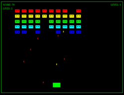
</a>

- Overall: start screen, 3 lives, level counter, score, no sound.
- Bugs: none
- Graphics: shapes with 'yes'. Multi-colored. Smooth animations
- Comments: basic, and works.
### Experiment <a href="https://github.com/DrMicrobit/lllm_suit/blob/main/tests/SpaceInvaders/online/Gemini25pro/t1">tests/SpaceInvaders/online/Gemini25pro/t1</a>

<a href="https://drmicrobit.github.io/lllm_suit/tests/SpaceInvaders/online/Gemini25pro/t1/space_invaders.html">
  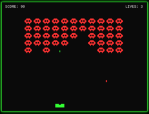
</a>

- Features: start screen, 3 lives, score, no sound.
- Bugs: no wave mechanics
- Graphics: simplistic monochrome alien sprite. Smooth animation.
- Comments: basic, works.

### Experiment <a href="https://github.com/DrMicrobit/lllm_suit/blob/main/tests/SpaceInvaders/online/Gemini25pro/t2">tests/SpaceInvaders/online/Gemini25pro/t2</a>

- Features: no start screen, 1 life, score, no sound.
- Bugs: wave mechanics with unequal number of aliens
- Graphics: simplistic monochrome alien sprite. Smooth animation. Particle effect explosions.
- Comments: basic, works.

### Experiment <a href="https://github.com/DrMicrobit/lllm_suit/blob/main/tests/SpaceInvaders/online/GPT5/t1">tests/SpaceInvaders/online/GPT5/t1</a>

<a href="https://drmicrobit.github.io/lllm_suit/tests/SpaceInvaders/online/GPT5/t1/space_invaders.html">
  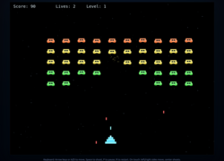
</a>

- Features: start screen, 3 lives, score, high score, sound. Took 3+ minutes to generate.
- Bugs: initoal version had a code error, did not start.
- Graphics: modern looking retro. Smooth animation. Aliens in slight waves. Particle effect explosions. Parallax starfield. Playing field dynamically adapts to browser window.
- Comments: probably best / most advanced version in this experiment.

### Experiment <a href="https://github.com/DrMicrobit/lllm_suit/blob/main/tests/SpaceInvaders/online/GPT5/t2">tests/SpaceInvaders/online/GPT5/t2</a>

<a href="https://drmicrobit.github.io/lllm_suit/tests/SpaceInvaders/online/GPT5/t2/space_invaders.html">
  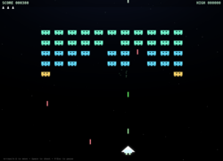
</a>

- Features: start screen, 3 lives as graphical display, score, high score, sound. Took 3+ minutes to generate.
- Bugs: alien formation movement reverses direction for already killed columns
- Graphics: modern looking retro. Smooth animation. Aliens in slight waves. Particle effect explosions. Parallax starfield.
- Comments: close seconds, bested only by other GPT5 version.

### Experiment <a href="https://github.com/DrMicrobit/lllm_suit/blob/main/tests/SpaceInvaders/online/Opus41/t1">tests/SpaceInvaders/online/Opus41/t1</a>

- Features: no start screen, 1 life, score, no sound.
- Bugs: no wave mechanics
- Graphics: simplistic basic shapes. Smooth animation.
- Comments: very basic, but works.

### Experiment <a href="https://github.com/DrMicrobit/lllm_suit/blob/main/tests/SpaceInvaders/online/Opus41/t2">tests/SpaceInvaders/online/Opus41/t2</a>

- Features: no start screen, 3 lives, score, no sound.
- Bugs: alien fire frequency way too low
- Graphics: simplistic basic shapes. Smooth animation.
- Comments: very basic, but works.

### Experiment <a href="https://github.com/DrMicrobit/lllm_suit/blob/main/tests/SpaceInvaders/online/Qwen3code-online/t1">tests/SpaceInvaders/online/Qwen3code-online/t1</a>

<a href="https://drmicrobit.github.io/lllm_suit/tests/SpaceInvaders/online/Qwen3code-online/t1/space_invaders.html">
  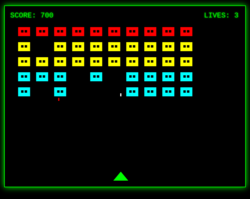
</a>

- Features: no start screen, 3 lives, score, no sound.
- Bugs: no wave mechanics
- Graphics: simplistic basic shapes. Smooth animation.
- Comments: very basic, but works.

### Experiment <a href="https://github.com/DrMicrobit/lllm_suit/blob/main/tests/SpaceInvaders/online/Qwen3code-online/t2">tests/SpaceInvaders/online/Qwen3code-online/t2</a>

- Features: no start screen, 3 lives, score, no sound.
- Bugs: initoal version had a code error, did not start. No wave mechanics, no difficulty increase.
- Graphics: simplistic basic shapes. Smooth animation.
- Comments: very basic, but works.

### Experiment <a href="https://github.com/DrMicrobit/lllm_suit/blob/main/tests/SpaceInvaders/online/Sonnet45/t1">tests/SpaceInvaders/online/Sonnet45/t1</a>

<a href="https://drmicrobit.github.io/lllm_suit/tests/SpaceInvaders/online/Sonnet45/t1/space_invaders.html">
  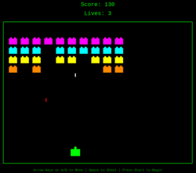
</a>

- Features: no start screen, 3 lives, score, no sound.
- Bugs: none
- Graphics: simplistic basic shapes. Smooth animation.
- Comments: very basic, but works.

### Experiment <a href="https://github.com/DrMicrobit/lllm_suit/blob/main/tests/SpaceInvaders/online/Sonnet45/t2">tests/SpaceInvaders/online/Sonnet45/t2</a>

<a href="https://drmicrobit.github.io/lllm_suit/tests/SpaceInvaders/online/Sonnet45/t2/space_invaders.html">
  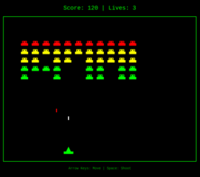
</a>

- Features: no start screen, 3 lives, score, no sound.
- Bugs: no wave mechanics
- Graphics: simplistic basic shapes. Smooth animation.
- Comments: very basic, but works.

## Local model experiments for Space Invaders

### Experiment <a href="https://github.com/DrMicrobit/lllm_suit/blob/main/tests/SpaceInvaders/local/qwen3-coder-30B-ollama/4bit_t1">tests/SpaceInvaders/local/qwen3-coder-30B-ollama/4bit_t1</a>

Very basic. Title screen, restart after game over. Smooth anim. 
Continuous autofire, 1 life.  Alien projectiles spawn in any row.
Needed 3 bugfixing iterations, inlcuding 1 game breaking (game did not start).

### Experiment <a href="https://github.com/DrMicrobit/lllm_suit/blob/main/tests/SpaceInvaders/local/qwen3-coder-30B-ollama/4bit_t2">tests/SpaceInvaders/local/qwen3-coder-30B-ollama/4bit_t2</a>

<a href="https://drmicrobit.github.io/lllm_suit/tests/SpaceInvaders/local/qwen3-coder-30B-ollama/4bit_t2/space_invaders.html">
  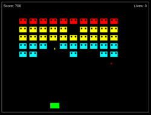
</a>

Very basic. Title screen, restart after game over. Smooth anim.
Continuous autofire, 3 lives. Alien projectiles spawn in any row.
Needed 2 bugfixing iterations.

### Experiment <a href="https://github.com/DrMicrobit/lllm_suit/blob/main/tests/SpaceInvaders/local/qwen3-coder-30B-ollama/4bit_t3">tests/SpaceInvaders/local/qwen3-coder-30B-ollama/4bit_t3</a>

<a href="https://drmicrobit.github.io/lllm_suit/tests/SpaceInvaders/local/qwen3-coder-30B-ollama/4bit_t3/space_invaders.html">
  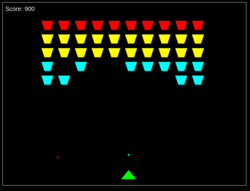
</a>

Very basic. Title screen, restart after game over. Smooth anim. 
Continuous autofire, 1 life. Alien projectiles spawn in any row. Player projectiles are
circles instead of lines like in other versions.
One-shot: no bugfixing.
### Experiment <a href="https://github.com/DrMicrobit/lllm_suit/blob/main/tests/SpaceInvaders/local/qwen3-coder-30B-ollama/4bit_t4">tests/SpaceInvaders/local/qwen3-coder-30B-ollama/4bit_t4</a>

<a href="https://drmicrobit.github.io/lllm_suit/tests/SpaceInvaders/local/qwen3-coder-30B-ollama/4bit_t4/space_invaders.html">
  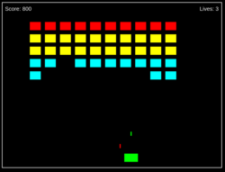
</a>

Very basic. No title screen, restart after game over.
Continuous autofire, 3 lives. Alien projectiles spawn in any row.
Could not get smooth animation even after 3 bugfixing iterations.

### Experiment <a href="https://github.com/DrMicrobit/lllm_suit/blob/main/tests/SpaceInvaders/local/qwen3-coder-30B-ollama/4bit_t5">tests/SpaceInvaders/local/qwen3-coder-30B-ollama/4bit_t5</a>

Very basic. Title screen, restart after game over.
Continuous autofire, 3 lives. Aliens don't shoot.
Could not get smooth anim after 3 bugfixing iterations.

### Experiment <a href="https://github.com/DrMicrobit/lllm_suit/blob/main/tests/SpaceInvaders/local/qwen3-coder-30B-unsloth/2bit_t1">tests/SpaceInvaders/local/qwen3-coder-30B-unsloth/2bit_t1</a>

<a href="https://drmicrobit.github.io/lllm_suit/tests/SpaceInvaders/local/qwen3-coder-30B-unsloth/2bit_t1/space_invaders.html">
  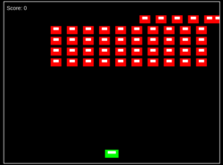
</a>

Extremely basic. No Title screen. Smooth anim.
Riddled with bugs: alien movement; player cannot be killed.

### Experiment <a href="https://github.com/DrMicrobit/lllm_suit/blob/main/tests/SpaceInvaders/local/qwen3-coder-30B-unsloth/2bit_t2">tests/SpaceInvaders/local/qwen3-coder-30B-unsloth/2bit_t2</a>

<a href="https://drmicrobit.github.io/lllm_suit/tests/SpaceInvaders/local/qwen3-coder-30B-unsloth/2bit_t2/space_invaders.html">
  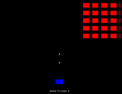
</a>

Extremely basic. Title screen. Smooth anim.
Bugs: alien movement; aliens don't shoot.
### Experiment <a href="https://github.com/DrMicrobit/lllm_suit/blob/main/tests/SpaceInvaders/local/qwen3-coder-30B-unsloth/3bit_t1">tests/SpaceInvaders/local/qwen3-coder-30B-unsloth/3bit_t1</a>

Weird mixture of modernised and retro graphics. Title screen. Smooth anim.
Riddled with bugs: Game did not start (needed bugfixing) alien movement; graphics scaling;
jagged animation.
### Experiment <a href="https://github.com/DrMicrobit/lllm_suit/blob/main/tests/SpaceInvaders/local/qwen3-coder-30B-unsloth/3bit_t2">tests/SpaceInvaders/local/qwen3-coder-30B-unsloth/3bit_t2</a>

Basic version. Title screen, restart after Game Over. Smooth alian anim, jagged player anim.
Buggy player anim and response to keypresses (delays).
### Experiment <a href="https://github.com/DrMicrobit/lllm_suit/blob/main/tests/SpaceInvaders/local/qwen3-coder-30B-unsloth/4bit_t1">tests/SpaceInvaders/local/qwen3-coder-30B-unsloth/4bit_t1</a>

Probably best local version. Smooth anim, starfield!
Plus:
- overall aesthetics of screen and text
- aliens have 'eyes'
- a moving starfield!
- score counter
- player has only 1 life

Bugs:
- the player can spam shots, laserlike
- the start button is too low on some browsers, almost hidden
- there are no waves: when the player has shot all aliens, a message appears with "You win", and the possibility to restart the game

### Experiment <a href="https://github.com/DrMicrobit/lllm_suit/blob/main/tests/SpaceInvaders/local/qwen3-coder-30B-unsloth/4bit_t2">tests/SpaceInvaders/local/qwen3-coder-30B-unsloth/4bit_t2</a>

Very basic version.
Bugs: aliens don't shoot, aliens move way too slow, game does not recognise player having shot all aliens.

### Experiment <a href="https://github.com/DrMicrobit/lllm_suit/blob/main/tests/SpaceInvaders/local/qwen3-coder-30B-unsloth/4bitUD_t1">tests/SpaceInvaders/local/qwen3-coder-30B-unsloth/4bitUD_t1</a>

<a href="https://drmicrobit.github.io/lllm_suit/tests/SpaceInvaders/local/qwen3-coder-30B-unsloth/4bitUD_t1/space_invaders.html">
  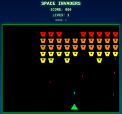
</a>

initial version 1 minutes 13 seconds. Nice aesthetics, but aliens move too slow.
- two additional fixing rounds (each 7 seconds) and aliens move fast enough, although jerky
- then: bug uncovered, when all aliens are shot no next wave appears. Fixing this took 20s.
- then: I notice that the wave difficulty does not increase, every wave runs at the same speed. Asking the model to "add a display for alien speed" not only adds said display, but the model suddenly realises the bug all by itself and fixes it. Oh wow.
- one last try to fix the jerky movement being unsuccessful (1 minute 45 seconds)
### Experiment <a href="https://github.com/DrMicrobit/lllm_suit/blob/main/tests/SpaceInvaders/local/qwen3-coder-30B-unsloth/4bitUD_t2">tests/SpaceInvaders/local/qwen3-coder-30B-unsloth/4bitUD_t2</a>

<a href="https://drmicrobit.github.io/lllm_suit/tests/SpaceInvaders/local/qwen3-coder-30B-unsloth/4bitUD_t2/space_invaders.html">
  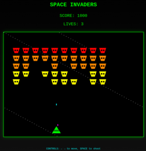
</a>

Quite nice version with a few quirks. Title screen, game over screen, smooth alien and player anim.
Bugs: starfield (stars are in a line).
